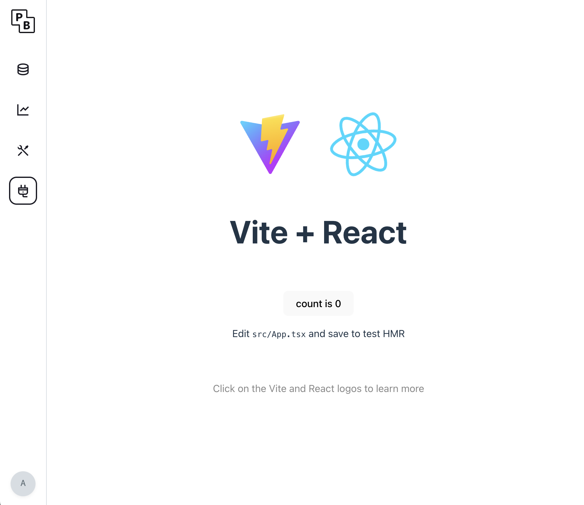

# PB-Plugable-Demo



A demonstration project showcasing how to use UI plugin system to extend the Pocketbase interface with custom React applications.   
**Latest version**: `0.28.4-plug`


## Quick Start

1. **Setup submodule**: `go get github.com/sospartan/pocketbase@v0.28.4-plug`
2. **Build React plugin**: `cd ui-plugins/simple_react && npm install && npm run build && cd ../..`
3. **Start application**: `go run . serve`

### Configure Vite for Plugin

The React plugin in [`/simple_react`](./ui-plugins/simple_react) is a basic frontend project generated entirely using the scaffolding command `npm create vite@latest . -- --template react-ts`, with only one modification to add the `base` configuration in `vite.config.ts`:

```typescript
export default defineConfig({
  base: '/ui-plugins/simple_react/', // Must match your plugin's base path
  plugins: [react()],
})
```

**Important**: The `base` path must match the `Base` field in your `plugin.go` file. For example:
- If your plugin.go has `Base: "simple_react"`, then vite.config.ts should have `base: '/ui-plugins/simple_react/'`


## Related Resources

- [PocketBase Official Documentation](https://pocketbase.io/docs)
- [UI Plugin System Documentation](./pocketbase/UI_PLUGIN_README.md)
- [PocketBase GitHub Repository](https://github.com/pocketbase/pocketbase)


